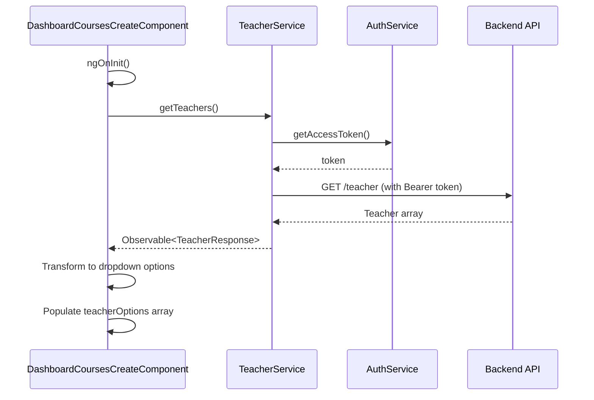

# Design Document: Dynamic Teacher Dropdown

## Overview

This design implements a dynamic teacher dropdown for the course creation/update form in the eduLearn Angular 19 platform. The current implementation has a hardcoded teacher option (Ahmed Hassan with ID `699ce46c86413bae7db7ca77`). This design replaces the hardcoded array with a dynamic system that fetches teachers from the backend `/teacher` endpoint.

The solution follows Angular best practices by creating a dedicated `TeacherService` that mirrors the existing `CourseService` pattern. The service handles API communication with proper authentication, while the `DashboardCoursesCreateComponent` manages the UI state including loading indicators and error handling.

Key design decisions:
- Create a new `TeacherService` rather than extending `CourseService` to maintain separation of concerns
- Fetch teachers during component initialization to ensure data is available before user interaction
- Maintain backward compatibility with existing form validation and submission logic
- Use the same authentication pattern (Bearer token) as other services in the application

## Architecture

### Component Hierarchy

```
DashboardCoursesCreateComponent
├── NavBarComponent
├── SideBarComponent
├── DropdownMenuComponent (subjects)
└── DropdownMenuComponent (teachers) ← Modified to use dynamic data
```

### Service Layer

```
TeacherService (new)
├── HttpClient (Angular)
├── AuthService (existing)
└── Observable<TeacherResponse>

CourseService (existing, unchanged)
└── Used for course CRUD operations
```

### Data Flow



## Components and Interfaces

### TeacherService

**Location:** `src/app/services/teacher.service.ts`

**Purpose:** Fetch teacher data from the backend API with proper authentication

**Dependencies:**
- `HttpClient` from `@angular/common/http`
- `AuthService` from `./auth.service`
- `Observable` from `rxjs`

**Methods:**

```typescript
getTeachers(): Observable<TeacherResponse>
```
- Fetches all teachers from `http://localhost:3000/teacher`
- Includes Authorization header with Bearer token
- Returns Observable containing teacher data

```typescript
private getHeaders(): HttpHeaders
```
- Creates HTTP headers with Authorization token
- Mirrors the pattern used in `CourseService`

**Implementation Notes:**
- Use `@Injectable({ providedIn: 'root' })` for singleton service
- Follow the exact same pattern as `CourseService.getHeaders()` and `CourseService.getSubjects()`
- Base URL constant: `http://localhost:3000`

### DashboardCoursesCreateComponent Modifications

**Location:** `src/app/pages/dashboard/dashboard-courses-create/dashboard-courses-create.component.ts`

**New Properties:**

```typescript
isLoadingTeachers: boolean = false;
```
- Tracks loading state for teacher fetch operation
- Used to show loading indicator in UI

**Modified Properties:**

```typescript
teacherOptions: { value: string, label: string }[] = [
  { value: '', label: 'Select Instructor' }
];
```
- Initialize with only the default option
- Populated dynamically after successful fetch

**New Methods:**

```typescript
fetchTeachers(): void
```
- Sets `isLoadingTeachers = true`
- Calls `teacherService.getTeachers()`
- On success: transforms teacher data to dropdown options format
- On error: logs error and maintains default option
- Finally: sets `isLoadingTeachers = false`

**Modified Methods:**

```typescript
ngOnInit(): void
```
- Add call to `fetchTeachers()` before checking for edit mode
- Ensures teachers are loaded before attempting to pre-select in edit mode

```typescript
fetchCourseDetails(id: string): void
```
- No changes to logic, but teachers must be loaded first
- Pre-selection will work automatically once teacherOptions is populated

**Initialization Sequence:**

1. `ngOnInit()` called
2. `fetchTeachers()` initiated (async)
3. `fetchSubjects()` initiated (async, existing)
4. Check for courseId parameter
5. If edit mode: `fetchCourseDetails()` called after teachers loaded

## Data Models

### Teacher Object (from API)

```typescript
interface Teacher {
  _id: string;           // MongoDB ObjectId
  username: string;      // Display name for dropdown
  firstName?: string;    // Optional: preferred for display
  lastName?: string;     // Optional: preferred for display
  email?: string;        // Not used in dropdown
  // ... other fields not relevant to dropdown
}
```

### Teacher Response (from API)

```typescript
interface TeacherResponse {
  message: string;
  status: number;
  data: {
    teachers: Teacher[];
  };
}
```

**Note:** This structure mirrors the subject response pattern observed in the existing codebase.

### Dropdown Option Format

```typescript
interface DropdownOption {
  value: string;    // Teacher._id
  label: string;    // Teacher display name
}
```

**Label Priority:**
1. If `firstName` and `lastName` exist: `"${firstName} ${lastName}"`
2. Otherwise: `username`

### Form Data Structure (unchanged)

```typescript
interface CourseFormValue {
  title: string;
  description: string;
  subjectId: string;
  teacherId: string;  // Still required, now dynamically populated
}
```


## Correctness Properties

*A property is a characteristic or behavior that should hold true across all valid executions of a system-essentially, a formal statement about what the system should do. Properties serve as the bridge between human-readable specifications and machine-verifiable correctness guarantees.*

### Property Reflection

After analyzing all acceptance criteria, I identified the following redundancies:

- Properties 2.4, 2.5, and 2.6 all relate to dropdown option transformation and can be combined into a single comprehensive property about correct teacher-to-option mapping
- Properties 4.1 and 4.3 about loading state can be combined into a single property about loading state lifecycle
- Property 1.3 is subsumed by the overall service contract and doesn't need separate testing beyond type checking

The following properties represent the unique, non-redundant correctness guarantees:

### Property 1: Authorization Header Inclusion

*For any* teacher fetch request made by the TeacherService, the HTTP request SHALL include an Authorization header with a Bearer token.

**Validates: Requirements 1.2**

### Property 2: Teacher Data Transformation

*For any* valid teacher response from the backend, the Dashboard_Component SHALL create dropdown options where each teacher maps to exactly one option with the teacher's ID as the value and the appropriate display name as the label (full name if firstName and lastName exist, otherwise username).

**Validates: Requirements 2.2, 2.4, 2.5, 2.6**

### Property 3: Error State Handling

*For any* teacher fetch error, the Dashboard_Component SHALL maintain only the default "Select Instructor" option in the dropdown and log the error to the console while keeping the form functional.

**Validates: Requirements 3.1, 3.2, 3.3**

### Property 4: Loading State Lifecycle

*For any* teacher fetch operation (successful or failed), the loading state flag SHALL be true when the operation starts and false when the operation completes.

**Validates: Requirements 4.1, 4.2, 4.3**

### Property 5: Form Validation Enforcement

*For any* form submission attempt where teacherId is empty or invalid, the Course_Form SHALL prevent submission and mark the teacherId field as invalid.

**Validates: Requirements 5.2**

### Property 6: Teacher Selection Updates Form

*For any* teacher selected from the dropdown, the Course_Form's teacherId field SHALL be updated with the selected teacher's ID.

**Validates: Requirements 5.3**

### Property 7: Edit Mode Pre-selection

*For any* course loaded in edit mode that has a teacherId, the Course_Form SHALL pre-select the teacher matching that teacherId in the dropdown.

**Validates: Requirements 6.2**

## Error Handling

### Teacher Fetch Failures

**Scenario:** Backend API is unavailable or returns an error

**Handling:**
1. Catch error in `fetchTeachers()` subscribe error callback
2. Log error to console with descriptive message: `'Error fetching teachers', err`
3. Maintain `teacherOptions` with only default option
4. Set `isLoadingTeachers = false` in finally block
5. Allow form to remain interactive

**User Impact:** User sees only "Select Instructor" option but can still fill out other form fields

### Authentication Failures

**Scenario:** Access token is missing or invalid

**Handling:**
1. HTTP interceptor (if configured) or service-level error handling
2. Backend returns 401 Unauthorized
3. Error propagates to component's error handler
4. Same error handling as general fetch failures

**User Impact:** Same as teacher fetch failures; user may need to re-authenticate

### Network Timeouts

**Scenario:** Request takes too long or network is unavailable

**Handling:**
1. HttpClient default timeout behavior applies
2. Error propagates to component error handler
3. Same error handling as general fetch failures

**User Impact:** Loading indicator shows, then error state with default option only

### Partial Data Issues

**Scenario:** Teacher object missing expected fields (username, firstName, lastName)

**Handling:**
1. Transformation logic handles missing fields gracefully
2. Use username as fallback if firstName/lastName missing
3. Use empty string if username also missing (edge case)
4. Option still created with valid ID

**User Impact:** Teacher appears in dropdown, possibly with incomplete name

### Edit Mode - Teacher Not Found

**Scenario:** Course has teacherId but that teacher is not in fetched list

**Handling:**
1. Form pre-selection uses `patchValue()` with the teacherId from course data
2. Dropdown shows the value even if not in options list (Angular behavior)
3. User can change selection to available teachers
4. If form submitted without change, original teacherId is preserved

**User Impact:** Dropdown may show ID instead of name, but form remains functional

## Testing Strategy

### Unit Testing Approach

Unit tests will focus on specific examples, edge cases, and integration points:

**TeacherService Tests:**
- Verify correct endpoint URL construction (`http://localhost:3000/teacher`)
- Verify Authorization header format with mock token
- Test error propagation from HttpClient

**DashboardCoursesCreateComponent Tests:**
- Verify `fetchTeachers()` is called during `ngOnInit()`
- Verify default "Select Instructor" option is always present
- Verify loading state flag behavior with mock service
- Verify error logging with mock console
- Verify form remains functional after fetch errors
- Verify teacher fetch occurs before course fetch in edit mode
- Verify existing functionality preserved (subjects, file upload, form submission)

**Edge Cases:**
- Empty teacher array from backend
- Teacher object with missing firstName/lastName
- Teacher object with missing username
- Edit mode with teacherId not in fetched list
- Multiple rapid component initializations

### Property-Based Testing Approach

Property tests will verify universal behaviors across all inputs using a property-based testing library. For Angular/TypeScript, we will use **fast-check** (https://github.com/dubzzz/fast-check).

**Configuration:**
- Minimum 100 iterations per property test
- Each test tagged with feature name and property reference

**Property Test 1: Authorization Header Inclusion**
```typescript
// Feature: dynamic-teacher-dropdown, Property 1: Authorization Header Inclusion
```
- Generate: random tokens
- Test: verify Authorization header contains Bearer token for each request
- Assert: header format is `Bearer ${token}`

**Property Test 2: Teacher Data Transformation**
```typescript
// Feature: dynamic-teacher-dropdown, Property 2: Teacher Data Transformation
```
- Generate: random teacher arrays with varying field combinations
- Test: transform to dropdown options
- Assert: 
  - Each teacher produces exactly one option
  - Option value equals teacher._id
  - Option label equals full name (if firstName/lastName exist) or username
  - Default option is always first

**Property Test 3: Error State Handling**
```typescript
// Feature: dynamic-teacher-dropdown, Property 3: Error State Handling
```
- Generate: random error objects
- Test: trigger fetch error with each error
- Assert:
  - teacherOptions contains only default option
  - Error is logged to console
  - Form remains interactive (not disabled)

**Property Test 4: Loading State Lifecycle**
```typescript
// Feature: dynamic-teacher-dropdown, Property 4: Loading State Lifecycle
```
- Generate: random success/error outcomes
- Test: execute fetch with each outcome
- Assert:
  - isLoadingTeachers is true immediately after fetch starts
  - isLoadingTeachers is false after completion (success or error)

**Property Test 5: Form Validation Enforcement**
```typescript
// Feature: dynamic-teacher-dropdown, Property 5: Form Validation Enforcement
```
- Generate: random form states with empty/invalid teacherId
- Test: attempt form submission
- Assert:
  - Form.invalid is true
  - teacherId field has error
  - onSubmit() returns early without API call

**Property Test 6: Teacher Selection Updates Form**
```typescript
// Feature: dynamic-teacher-dropdown, Property 6: Teacher Selection Updates Form
```
- Generate: random teacher IDs
- Test: simulate dropdown selection change
- Assert: courseForm.value.teacherId equals selected ID

**Property Test 7: Edit Mode Pre-selection**
```typescript
// Feature: dynamic-teacher-dropdown, Property 7: Edit Mode Pre-selection
```
- Generate: random course objects with teacherId
- Test: load component in edit mode with each course
- Assert: courseForm.value.teacherId equals course.teacherId after load

### Testing Balance

- Unit tests handle specific examples (URL format, default option presence, initialization sequence)
- Property tests handle comprehensive input coverage (all possible teacher arrays, all error types, all form states)
- Together they provide complete coverage: unit tests catch concrete bugs, property tests verify general correctness

### Test Execution

- Run unit tests with: `ng test`
- Run property tests with: `ng test` (integrated into same test suite)
- CI/CD should run all tests before deployment
- Minimum 100 iterations configured for each property test in fast-check
